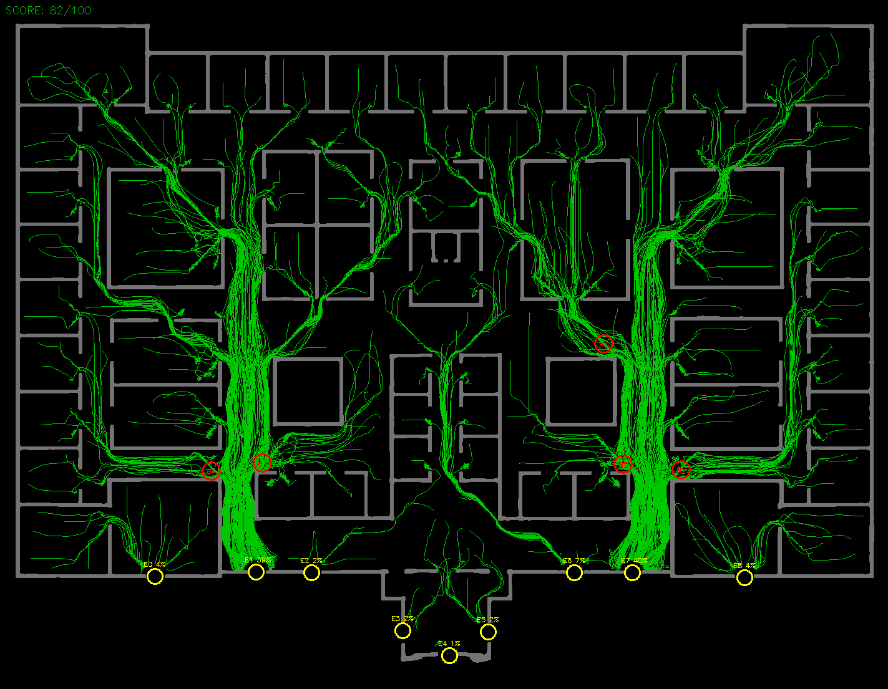
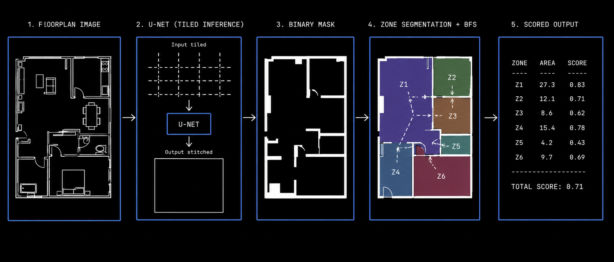
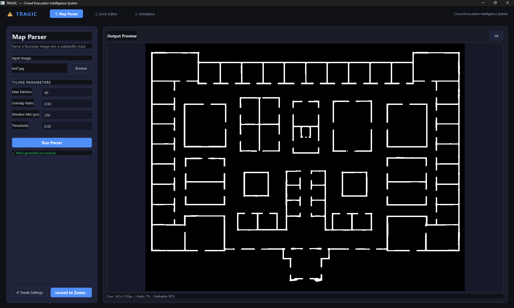
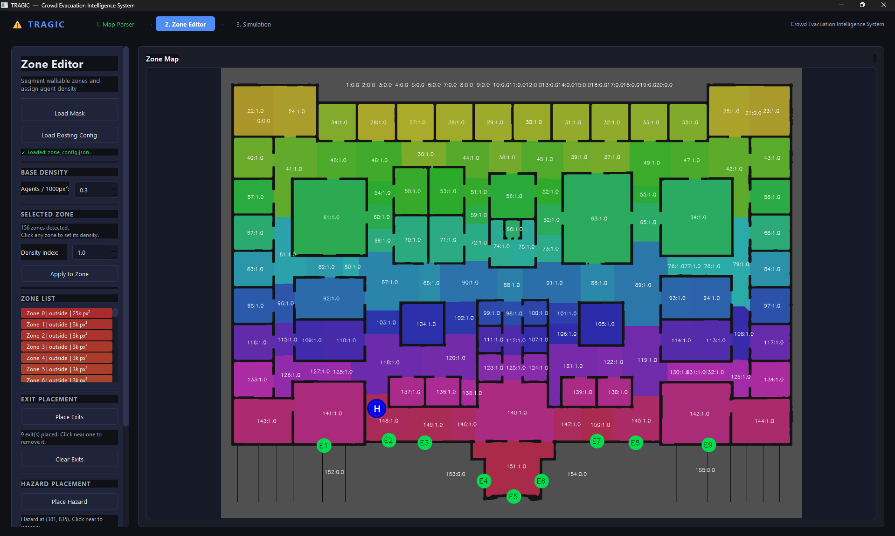
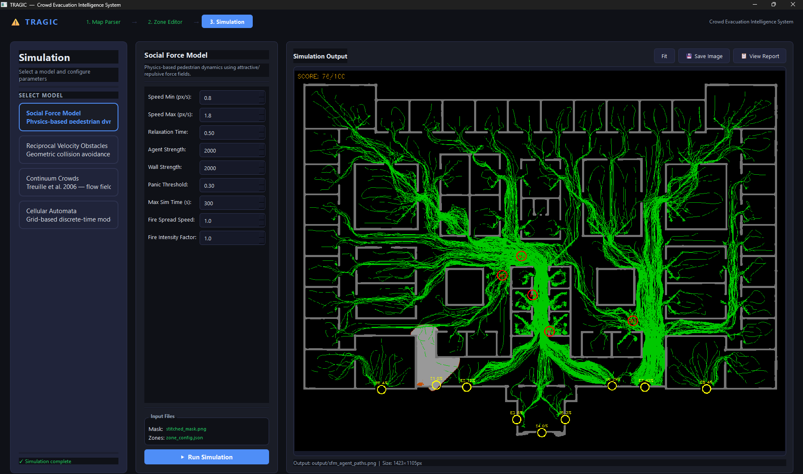

# T.R.A.G.I.C.
### Tactical Risk Assessment & Grid-based Intelligent Crowd Simulation

> Feed it a floorplan. It tells you where people die.



---

## The Why

Most building safety tools either cost a fortune or require you to hand-draw every wall and corridor into a proprietary format. TRAGIC takes a floorplan image — a photo, a scan, an architect's PNG — runs it through a trained U-Net to extract walkable space automatically, then simulates a crowd evacuation using four different algorithms. At the end you get a score, a heatmap, and a concrete recommendation like "the corridor at (420, 310) is your worst chokepoint, widen it."

Built for architects and students who want to understand whether a layout is actually safe, not just compliant on paper.

---

## How It's Structured

```
T.R.A.G.I.C/
├── Tragic_launcher.py           # Main GUI — 3-view pipeline
├── predict_tiled.py             # Standalone map parser (no GUI)
├── model.py                     # U-Net definition
├── unet.pth                     # Trained weights (you need this)
├── zone_detector.py             # Standalone zone editor (no GUI)
├── SFM_evacuation.py            # Social Force Model
├── RVO_evacuation.py            # Reciprocal Velocity Obstacles
├── continuum_evacuation_path.py # Continuum Crowds (Treuille 2006)
├── continuum_evacuation_sim.py  # Interactive continuum viewer (This is not connected to the code, kinda unnecessary. lol)
├── CA_evacuation.py             # Cellular Automata
└── output/                      # Everything written here at runtime
    ├── sfm_agent_paths.png
    ├── rvo_agent_paths.png
    ├── continuum_agent_paths.png
    ├── ca_paths.png
    └── *.txt                    # per-model text reports
```

The pipeline has three stages:



**Stage 1 — Map Parser**: Tiles the input image with 50% overlap, runs each patch through the U-Net, Gaussian-blends predictions back, binarizes to `stitched_mask.png` (black = walkable, white = wall).

**Stage 2 — Zone Editor**: Watershed segmentation splits walkable area into rooms/corridors. You click zones to set agent density and place exit markers. Saves to a JSON config.

**Stage 3 — Simulation**: Launches one of the four simulation scripts as a subprocess, streams output to the UI, displays the result image and report.

---

## Quick Start

**Prerequisites:** Python 3.10+, and `unet.pth` placed in the project root.

```bash
git clone https://github.com/sankhya007/T.R.A.G.I.C
cd T.R.A.G.I.C
pip install torch>=2.0.0 opencv-python>=4.8.0 numpy>=1.24.0 scipy>=1.11.0 scikit-image>=0.21.0 PyQt6>=6.5.0
```

No GPU? Use the CPU-only torch wheel:
```bash
pip install torch --index-url https://download.pytorch.org/whl/cpu
pip install opencv-python numpy scipy scikit-image PyQt6
```

Don't want to train the Model yourself? No problem here is the lin to download:
[Hugging Face Link](https://huggingface.co/sankhya007/Floorplan_parser_STITCH/tree/main)

```bash
python Tragic_launcher.py
```

No config files, no environment variables. Everything is driven through the UI.

---

## Feature Walkthrough

### 1. Tiled Map Parsing

The U-Net was trained on 256×256 patches, but real floorplans can be 3000×2000px. The parser computes a window size backwards from a patch budget — so you never exceed 40 tiles regardless of input resolution. Bigger image, bigger window, same patch count.

```python
aspect = pW / pH
n_cols_est = math.sqrt(MAX_PATCHES * aspect)
n_rows_est = math.sqrt(MAX_PATCHES / aspect)
WINDOW = max(WINDOW_MIN, int(math.ceil(max(pW / (n_cols_est * 0.5),
                                           pH / (n_rows_est * 0.5)))))
```

Each patch gets a Gaussian weight map so edges blend smoothly instead of leaving hard seams.



---

### 2. Zone Editor & Agent Config

Watershed segmentation automatically splits the walkable area into rooms and corridors. Click a zone, set its density index, and agent count is:

```python
agents = int(area_px * density_index * base_density / 1000)
```

A 5000px² room at density 1.0 with base 1.0 gets 5 agents. Set density to 0 to exclude a zone entirely. Exits are placed by clicking the map in Exit Mode, saved as `{"x": int, "y": int}` in the JSON — the same format every simulation script reads.



---

### 3. Four Simulation Algorithms

All four models take the same inputs and produce the same output structure: scored image with agent trails, exit utilization percentages, and bottleneck markers.

| Model | Core mechanic | Best for |
|---|---|---|
| SFM | Attractive/repulsive force fields | General-purpose |
| RVO | ORCA half-plane collision avoidance | Dense crowds, lane formation |
| Continuum | Treuille 2006 potential field + density | Large crowds, fluid behavior |
| CA | Grid cells, Moore neighbourhood, BFS cost | Fast, discrete, good bottleneck detection |

Score is 0–100 across four components (same formula in all four scripts):

```python
score_rate    = (evacuated / total) * 50
score_time    = max(0, 20 * (1 - (mean_t - 20) / 60)) if mean_t > 20 else 20.0
score_balance = max(0, 15 * (1 - max_exit_deviation / ideal))
score_bn      = max(0, 15 * (1 - (bn_fraction - 0.05) / 0.45))
final_score   = int(score_rate + score_time + score_balance + score_bn)
```



---

## Gotchas

**"Output image not found" after simulation runs**
The launcher copies mask and zone config to hardcoded filenames in the project root before launching any subprocess. Always launch `Tragic_launcher.py` from the project root, not from a subdirectory.

**Continuum model is slow on large masks**
`grid_res` controls potential field resolution (default 4px per cell). If the sim is crawling, push it to 6 or 8 in the config panel. You lose some path accuracy but it becomes usable.

**Agents spawn but zero evacuate**
Either (a) exit markers landed on a wall pixel — place them clearly inside a corridor, or (b) you saved the zone config before placing any exits so the `"exits"` array in the JSON is empty. Open the JSON and check. Exit radius defaults to 22px; if exits are in tight spaces, increase it.

---

## License

MIT — do whatever you want with it.